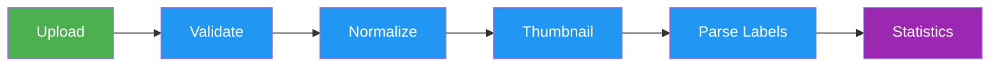
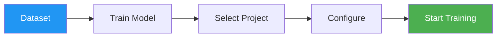

# Datasets

[Ultralytics Platform](https://platform.ultralytics.com) datasets provide a streamlined solution for managing your training data. Once uploaded, datasets can be immediately used for model training, with automatic processing and statistics generation.

## Upload Dataset

Ultralytics Platform accepts multiple upload formats for flexibility.

### Supported Formats

=== "Images"

    | Format | Extensions      | Notes                    | Max Size |
    | ------ | --------------- | ------------------------ | -------- |
    | JPEG   | `.jpg`, `.jpeg` | Most common, recommended | 50 MB    |
    | PNG    | `.png`          | Supports transparency    | 50 MB    |
    | WebP   | `.webp`         | Modern, good compression | 50 MB    |
    | BMP    | `.bmp`          | Uncompressed             | 50 MB    |
    | TIFF   | `.tiff`, `.tif` | High quality             | 50 MB    |
    | HEIC   | `.heic`         | iPhone photos            | 50 MB    |
    | AVIF   | `.avif`         | Next-gen format          | 50 MB    |
    | JP2    | `.jp2`          | JPEG 2000                | 50 MB    |
    | DNG    | `.dng`          | Raw camera               | 50 MB    |
    | MPO    | `.mpo`          | Multi-picture object     | 50 MB    |

=== "Videos"

    Videos are automatically extracted to frames on the client side at 1 FPS (max 100 frames per video).

    | Format | Extensions | Extraction            | Max Size |
    | ------ | ---------- | --------------------- | -------- |
    | MP4    | `.mp4`     | 1 FPS, max 100 frames | 1 GB     |
    | WebM   | `.webm`    | 1 FPS, max 100 frames | 1 GB     |
    | MOV    | `.mov`     | 1 FPS, max 100 frames | 1 GB     |
    | AVI    | `.avi`     | 1 FPS, max 100 frames | 1 GB     |
    | MKV    | `.mkv`     | 1 FPS, max 100 frames | 1 GB     |
    | M4V    | `.m4v`     | 1 FPS, max 100 frames | 1 GB     |

    !!! info "Video Frame Extraction"

        Video frames are extracted at 1 frame per second in the browser before upload. A 60-second video produces 60 frames. The maximum is 100 frames per video, so videos longer than ~100 seconds will be sampled.

=== "Archives"

    Archives are extracted and processed automatically.

    | Format | Extensions        | Notes                | Max Size |
    | ------ | ----------------- | -------------------- | -------- |
    | ZIP    | `.zip`            | Most common          | 10 GB    |
    | TAR    | `.tar`            | Uncompressed archive | 10 GB    |
    | TAR.GZ | `.tar.gz`, `.tgz` | Compressed archive   | 10 GB    |
    | GZ     | `.gz`             | Gzip compressed      | 10 GB    |

### Preparing Your Dataset

The Platform supports both [Ultralytics YOLO](../../datasets/detect/index.md#ultralytics-yolo-format) and [COCO](https://cocodataset.org/#format-data) annotation formats:

=== "YOLO Format"

    Use the standard YOLO directory structure with a `data.yaml` file:

    ```
    my-dataset/
    ├── images/
    │   ├── train/
    │   │   ├── img001.jpg
    │   │   └── img002.jpg
    │   └── val/
    │       ├── img003.jpg
    │       └── img004.jpg
    ├── labels/
    │   ├── train/
    │   │   ├── img001.txt
    │   │   └── img002.txt
    │   └── val/
    │       ├── img003.txt
    │       └── img004.txt
    └── data.yaml
    ```

    The YAML file defines your dataset configuration:

    ```yaml
    # data.yaml
    path: .
    train: images/train
    val: images/val

    names:
        0: person
        1: car
        2: dog
    ```

=== "COCO Format"

    Use JSON annotation files with the standard [COCO structure](https://cocodataset.org/#format-data):

    ```
    my-coco-dataset/
    ├── train/
    │   ├── _annotations.coco.json
    │   ├── img001.jpg
    │   └── img002.jpg
    └── val/
        ├── _annotations.coco.json
        ├── img003.jpg
        └── img004.jpg
    ```

    The JSON file contains `images`, `annotations`, and `categories` arrays:

    ```json
    {
        "images": [{ "id": 1, "file_name": "img001.jpg", "width": 640, "height": 480 }],
        "annotations": [{ "id": 1, "image_id": 1, "category_id": 0, "bbox": [100, 50, 200, 300] }],
        "categories": [{ "id": 0, "name": "person" }]
    }
    ```

    COCO annotations are automatically converted during upload. Detection (`bbox`), segmentation (`segmentation` polygons), and pose (`keypoints`) tasks are supported. Category IDs are remapped to a dense 0-indexed sequence across all annotation files. For converting between formats, see [format conversion tools](../../datasets/detect/index.md#port-or-convert-label-formats).

!!! tip "Flat Directory Structure"

    You can also upload images without the train/val folder structure. Images uploaded without split folders are assigned to the `train` split by default. You can reassign them later using bulk move/copy.

!!! tip "Format Auto-Detection"

    The format is detected automatically: datasets with a `data.yaml` containing `names`, `train`, or `val` keys are treated as YOLO. Datasets with COCO JSON files (containing `images`, `annotations`, and `categories` arrays) are treated as COCO.

For task-specific format details, see [supported tasks](index.md#supported-tasks) and the [Datasets Overview](../../datasets/index.md).

### Upload Process

1. Navigate to `Datasets` in the sidebar
2. Click `Upload Dataset` or drag files into the upload zone
3. Select the task type (see [supported tasks](index.md#supported-tasks))
4. Add a name and optional description
5. Click `Upload`


After upload, the Platform processes your data through a multi-stage pipeline:



1. **Validation**: Format and size checks
2. **Normalization**: Large images resized (max 4096px, min dimension 64px)
3. **Thumbnails**: 256px WebP previews generated
4. **Label Parsing**: [YOLO](../../datasets/detect/index.md#ultralytics-yolo-format) and COCO format labels extracted
5. **Statistics**: Class distributions and image dimensions computed


??? tip "Validate Before Upload"

    You can validate your dataset locally before uploading:

    ```python
    from ultralytics.hub import check_dataset

    check_dataset("path/to/dataset.zip", task="detect")
    ```

!!! warning "Image Size Requirements"

    Images must be at least 64px on their shortest side. Images smaller than this are rejected during processing. Images larger than 4096px on their longest side are automatically resized with aspect ratio preserved and converted to WebP (quality 92).

## Browse Images

View your dataset images in multiple layouts:

| View        | Description                                             |
| ----------- | ------------------------------------------------------- |
| **Grid**    | Thumbnail grid with annotation overlays (default)       |
| **Compact** | Smaller thumbnails for quick scanning                   |
| **Table**   | List with filename, dimensions, split, and label counts |


### Sorting and Filtering

Images can be sorted and filtered for efficient browsing:

=== "Sort Options"

    | Sort            | Description          |
    | --------------- | -------------------- |
    | Newest          | Most recently added  |
    | Oldest          | Earliest added       |
    | Name A-Z        | Alphabetical         |
    | Name Z-A        | Reverse alphabetical |
    | Size (smallest) | Smallest files first |
    | Size (largest)  | Largest files first  |
    | Most labels     | Most annotations     |
    | Fewest labels   | Fewest annotations   |

=== "Filters"

    | Filter           | Options                            |
    | ---------------- | ---------------------------------- |
    | **Split filter** | Train, Val, Test, or All           |
    | **Label filter** | All, Labeled only, or Unlabeled    |
    | **Search**       | Filter images by filename          |

!!! tip "Finding Unlabeled Images"

    Use the label filter set to `Unlabeled` to quickly find images that still need annotation. This is especially useful for large datasets where you want to track labeling progress.

### Fullscreen Viewer

Click any image to open the fullscreen viewer with:

- **Navigation**: Arrow keys or thumbnail previews to browse
- **Metadata**: Filename, dimensions, split badge, annotation count
- **Annotations**: Toggle annotation overlay visibility
- **Class Breakdown**: Per-class label counts with color indicators
- **Edit**: Enter annotation mode to add or modify labels
- **Zoom**: `Cmd/Ctrl+Scroll` to zoom in/out
- **Pixel view**: Toggle pixelated rendering for close inspection


### Filter by Split

Filter images by their dataset split:

| Split     | Purpose                             |
| --------- | ----------------------------------- |
| **Train** | Used for model training             |
| **Val**   | Used for validation during training |
| **Test**  | Used for final evaluation           |

## Dataset Tabs

Each dataset page has five tabs accessible from the tab bar:

### Images Tab

The default view showing the image gallery with annotation overlays. Supports grid, compact, and table view modes. Drag and drop files here to add more images.

### Classes Tab

Manage annotation classes for your dataset:

- **Class histogram**: Bar chart showing annotation count per class with linear/log scale toggle
- **Class table**: Sortable, searchable table with class name, label count, and image count
- **Edit class names**: Click any class name to rename it inline
- **Edit class colors**: Click a color swatch to change the class color
- **Add new class**: Use the input at the bottom to add classes


!!! note "Log Scale for Imbalanced Datasets"

    If your dataset has class imbalance (e.g., 10,000 "person" annotations but only 50 "bicycle"), use the `Log Scale` toggle on the class histogram to visualize all classes clearly.

### Charts Tab

Automatic statistics computed from your dataset:

| Chart                    | Description                                                    |
| ------------------------ | -------------------------------------------------------------- |
| **Split Distribution**   | Donut chart of train/val/test image counts and labeled percent |
| **Top Classes**          | Donut chart of the 10 most frequent annotation classes         |
| **Image Widths**         | Histogram of image width distribution with mean                |
| **Image Heights**        | Histogram of image height distribution with mean               |
| **Points per Instance**  | Polygon vertex or keypoint count per annotation (segment/pose) |
| **Annotation Locations** | 2D heatmap of bounding box center positions                    |
| **Image Dimensions**     | 2D width vs height heatmap with aspect ratio guide lines       |


!!! tip "Statistics Caching"

    Statistics are cached for 5 minutes. Changes to annotations will be reflected after the cache expires.

!!! info "Fullscreen Heatmaps"

    Click the expand button on any heatmap to view it in fullscreen mode. This provides a larger, more detailed view — useful for understanding spatial patterns in large datasets.

### Models Tab

View all models trained on this dataset in a searchable table:

| Column   | Description               |
| -------- | ------------------------- |
| Name     | Model name with link      |
| Project  | Parent project with icon  |
| Status   | Training status badge     |
| Task     | YOLO task type            |
| Epochs   | Best epoch / total epochs |
| mAP50-95 | Mean average precision    |
| mAP50    | mAP at IoU 0.50           |
| Created  | Creation date             |


### Errors Tab

Images that failed processing are listed here with:

- **Error banner**: Total count of failed images and guidance
- **Error table**: Filename, user-friendly error description, fix hints, and preview thumbnail
- Common errors include corrupted files, unsupported formats, images too small (min 64px), and unsupported color modes

<!-- Screenshot: platform-datasets-errors-tab-processing-failures.avif -->

??? info "Common Processing Errors"

    | Error                      | Cause                                   | Fix                                    |
    | -------------------------- | --------------------------------------- | -------------------------------------- |
    | Unable to read image file  | Corrupted or unsupported format         | Re-export from image editor            |
    | Incomplete or corrupted    | File was truncated during transfer      | Re-download the original file          |
    | Image too small            | Minimum dimension below 64px            | Use higher resolution source images    |
    | Unsupported color mode     | CMYK or indexed color mode              | Convert to RGB mode                    |

## Export Dataset

Export your dataset in [NDJSON](../../datasets/detect/index.md#ultralytics-ndjson-format) format for offline use:

1. Open the dataset actions menu
2. Click `Export`
3. Download the NDJSON file


The NDJSON format stores one JSON object per line. The first line contains dataset metadata, followed by one line per image:

```json
{"type": "dataset", "task": "detect", "name": "my-dataset", "class_names": {"0": "person", "1": "car"}}
{"type": "image", "file": "img001.jpg", "url": "https://...", "width": 640, "height": 480, "split": "train", "annotations": {"boxes": [[0, 0.5, 0.5, 0.2, 0.3]]}}
{"type": "image", "file": "img002.jpg", "url": "https://...", "width": 1280, "height": 720, "split": "val"}
```

!!! note "Signed URLs"

    Image URLs in the exported NDJSON are signed and valid for 7 days. If you need fresh URLs, re-export the dataset.

See the [Ultralytics NDJSON format documentation](../../datasets/detect/index.md#ultralytics-ndjson-format) for full specification.

## Bulk Move/Copy Images

Move or copy images between datasets:

1. Select images in the gallery using checkboxes
2. Click `Move` or `Copy` from the selection toolbar
3. Select the destination dataset

!!! tip "Organizing Train/Val Splits"

    Use bulk move to manually create train/val/test splits. Upload all images to one dataset, then move a subset to a validation or test dataset.

## Dataset URI

Reference Platform datasets using the `ul://` URI format (see [Using Platform Datasets](../api/index.md#using-platform-datasets)):

```
ul://username/datasets/dataset-slug
```

Use this URI to train models from anywhere:

=== "CLI"

    ```bash
    export ULTRALYTICS_API_KEY="your_api_key"
    yolo train model=yolo26n.pt data=ul://username/datasets/my-dataset epochs=100
    ```

=== "Python"

    ```python
    from ultralytics import YOLO

    model = YOLO("yolo26n.pt")
    model.train(data="ul://username/datasets/my-dataset", epochs=100)
    ```

!!! example "Train Anywhere with Platform Data"

    The `ul://` URI works from any environment:

    - **Local machine**: Train on your hardware, data downloaded automatically
    - **Google Colab**: Access your Platform datasets in notebooks
    - **Remote servers**: Train on cloud VMs with full dataset access

## Visibility Settings

Control who can see your dataset:

| Setting     | Description                     |
| ----------- | ------------------------------- |
| **Private** | Only you can access             |
| **Public**  | Anyone can view on Explore page |


To change visibility:

1. Open dataset actions menu
2. Click `Edit`
3. Toggle visibility setting
4. Click `Save`

## Edit Dataset

Update dataset name, description, task type, or visibility:

1. Open dataset actions menu
2. Click `Edit`
3. Make changes
4. Click `Save`

!!! warning "Changing Task Type"

    Changing the task type may affect how existing annotations are visualized. Incompatible annotations won't be displayed.

## Delete Dataset

Delete a dataset you no longer need:

1. Open dataset actions menu
2. Click `Delete`
3. Confirm deletion

!!! note "Trash and Restore"

    Deleted datasets are moved to Trash for 30 days. You can restore them from [`Settings > Trash`](../account/trash.md).

## Train on Dataset

Start training directly from your dataset:

1. Click `Train Model` on the dataset page
2. Select a project or create new
3. Configure training parameters
4. Start training



See [Cloud Training](../train/cloud-training.md) for details.

## FAQ

### What happens to my data after upload?

Your data is processed and stored in your selected region (US, EU, or AP). Images are:

1. Validated for format and size
2. Rejected if minimum dimension is below 64px
3. Normalized if larger than 4096px (preserving aspect ratio, converted to WebP q92)
4. Stored using Content-Addressable Storage (CAS) with XXH3-128 hashing
5. Thumbnails generated at 256px WebP for fast browsing

### How does storage work?

Ultralytics Platform uses **Content-Addressable Storage (CAS)** for efficient storage:

- **Deduplication**: Identical images uploaded by different users are stored only once
- **Integrity**: XXH3-128 hashing ensures data integrity
- **Efficiency**: Reduces storage costs and speeds up processing
- **Regional**: Data stays in your selected region (US, EU, or AP)

### Can I add images to an existing dataset?

Yes, drag and drop files onto the dataset page or use the upload button to add additional images. New statistics will be computed automatically.

### How do I move images between datasets?

Use the bulk selection feature:

1. Select images in the gallery
2. Click `Move` or `Copy`
3. Select destination dataset

### What label formats are supported?

Ultralytics Platform supports two annotation formats:

=== "YOLO Format"

    One `.txt` file per image with normalized coordinates (0-1 range):

    | Task     | Format                           | Example                             |
    | -------- | -------------------------------- | ----------------------------------- |
    | Detect   | `class cx cy w h`                | `0 0.5 0.5 0.2 0.3`                 |
    | Segment  | `class x1 y1 x2 y2 ...`          | `0 0.1 0.1 0.9 0.1 0.9 0.9`         |
    | Pose     | `class cx cy w h kx1 ky1 v1 ...` | `0 0.5 0.5 0.2 0.3 0.6 0.7 2`       |
    | OBB      | `class x1 y1 x2 y2 x3 y3 x4 y4`  | `0 0.1 0.1 0.9 0.1 0.9 0.9 0.1 0.9` |
    | Classify | Directory structure              | `train/cats/`, `train/dogs/`        |

    Pose visibility flags: 0=not labeled, 1=labeled but occluded, 2=labeled and visible.

=== "COCO Format"

    JSON files with `images`, `annotations`, and `categories` arrays. Supports detection (`bbox`), segmentation (polygon), and pose (`keypoints`) tasks. COCO uses absolute pixel coordinates which are automatically converted to normalized format during upload.
