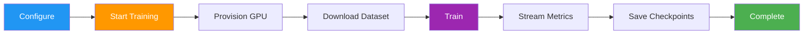
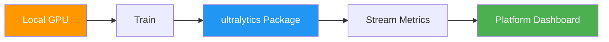
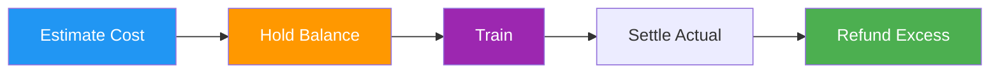

# Cloud Training

[Ultralytics Platform](https://platform.ultralytics.com) Cloud Training offers single-click training on cloud GPUs, making model training accessible without complex setup. Train YOLO models with real-time metrics streaming and automatic checkpoint saving.



## Training Dialog

Start training from the Platform UI by clicking **New Model** on any project page (or **Train** from a dataset page). The training dialog has two tabs: **Cloud Training** and **Local Training**.

<!-- Screenshot: platform-training-dialog-cloud-tab.avif -->

### Step 1: Select Base Model

Choose from official YOLO26 models or your own trained models:

| Category        | Description                              |
| --------------- | ---------------------------------------- |
| **Official**    | All 25 YOLO26 models (5 sizes x 5 tasks) |
| **Your Models** | Your completed models for fine-tuning    |

Official models are organized by task type (Detect, Segment, Pose, OBB, Classify) with sizes from nano to xlarge.

### Step 2: Select Dataset

Choose a dataset to train on:

| Option            | Description                       |
| ----------------- | --------------------------------- |
| **Official**      | Curated datasets from Ultralytics |
| **Your Datasets** | Datasets you've uploaded          |

!!! note "Dataset Requirements"

    Datasets must be in `ready` status with at least 1 image in the train split, 1 image in the validation or test split, and at least 1 labeled image.

!!! warning "Task Mismatch"

    A task mismatch warning appears if the model task (e.g., detect) doesn't match the dataset task (e.g., segment). Training will fail if you proceed with mismatched tasks. Ensure both model and dataset use the same task type.

### Step 3: Configure Parameters

Set core training parameters:

| Parameter      | Description                        | Default |
| -------------- | ---------------------------------- | ------- |
| **Epochs**     | Number of training iterations      | 100     |
| **Batch Size** | Samples per iteration              | 16      |
| **Image Size** | Input resolution (320-1280)        | 640     |
| **Run Name**   | Optional name for the training run | auto    |

### Step 4: Advanced Settings (Optional)

Expand **Advanced Settings** to access the full YAML-based parameter editor with 50+ training parameters organized by group:

| Group                   | Parameters                                       |
| ----------------------- | ------------------------------------------------ |
| **Learning Rate**       | lr0, lrf, momentum, weight_decay, warmup epochs  |
| **Optimizer**           | SGD, Adam, AdamW, NAdam, RAdam, RMSProp, Adamax  |
| **Loss Weights**        | box, cls, dfl, pose, kobj, label_smoothing       |
| **Color Augmentation**  | hsv_h, hsv_s, hsv_v                              |
| **Geometric Augment.**  | degrees, translate, scale, shear, perspective    |
| **Flip & Mix Augment.** | flipud, fliplr, mosaic, mixup, copy_paste        |
| **Training Control**    | patience, time, seed, deterministic, amp, cos_lr |
| **Dataset**             | fraction, freeze, single_cls, rect, multi_scale  |
| **Device & Inference**  | device, cache, workers, dropout, iou, max_det    |

Parameters are task-aware (e.g., `copy_paste` only shows for segment tasks, `pose`/`kobj` only for pose tasks). A **Modified** badge appears when values differ from defaults, and you can reset all to defaults with the reset button.

??? example "Example: Tuning Augmentation for Small Datasets"

    For small datasets (<1000 images), increase augmentation to reduce overfitting:

    ```yaml
    mosaic: 1.0       # Keep mosaic on
    mixup: 0.3        # Add mixup blending
    copy_paste: 0.3   # Add copy-paste (segment only)
    fliplr: 0.5       # Horizontal flip
    degrees: 10.0     # Slight rotation
    scale: 0.9        # Aggressive scaling
    ```

### Step 5: Select GPU (Cloud Tab)

Choose your GPU from Ultralytics Cloud:

<!-- Screenshot: platform-training-dialog-gpu-selector-and-cost.avif -->

| Tier       | GPU          | VRAM   | Cost/Hour |
| ---------- | ------------ | ------ | --------- |
| Budget     | RTX 2000 Ada | 16 GB  | $0.24     |
| Budget     | RTX A4500    | 20 GB  | $0.24     |
| Budget     | RTX A5000    | 24 GB  | $0.26     |
| Budget     | RTX 4000 Ada | 20 GB  | $0.38     |
| Budget     | L4           | 24 GB  | $0.39     |
| Budget     | A40          | 48 GB  | $0.40     |
| Budget     | RTX 3090     | 24 GB  | $0.46     |
| Budget     | RTX A6000    | 48 GB  | $0.49     |
| Mid        | RTX 4090     | 24 GB  | $0.59     |
| Mid        | RTX 6000 Ada | 48 GB  | $0.77     |
| Mid        | L40S         | 48 GB  | $0.86     |
| Mid        | RTX 5090     | 32 GB  | $0.89     |
| Mid        | L40          | 48 GB  | $0.99     |
| Pro        | A100 PCIe    | 80 GB  | $1.39     |
| Pro        | A100 SXM     | 80 GB  | $1.49     |
| Pro        | RTX PRO 6000 | 96 GB  | $1.89     |
| Enterprise | H100 PCIe    | 80 GB  | $2.39     |
| Enterprise | H100 SXM     | 80 GB  | $2.69     |
| Enterprise | H100 NVL     | 94 GB  | $3.07     |
| Enterprise | H200 NVL     | 143 GB | $3.39     |
| Enterprise | H200 SXM     | 141 GB | $3.59     |
| Enterprise | B200         | 180 GB | $4.99     |

!!! tip "GPU Selection"

    - **RTX 4090**: Best price/performance ratio for most jobs at $0.59/hr
    - **A100 SXM**: Required for large batch sizes or big models
    - **H100/H200**: Maximum performance for time-sensitive training
    - **RTX PRO 6000**: 96 GB Blackwell generation, default GPU
    - **B200**: NVIDIA Blackwell architecture for cutting-edge workloads

The dialog shows your current **balance** and a **Top Up** button. An estimated cost and duration are calculated based on your configuration (model size, dataset images, epochs, GPU speed).

### Step 6: Start Training

Click **Start Training** to launch your job. The Platform:

1. Provisions a GPU instance
2. Downloads your dataset
3. Begins training
4. Streams metrics in real-time

!!! success "Free Credits"

    New accounts receive $5 in signup credits — enough for several training runs. [Check your balance](../account/billing.md) in Settings > Billing.

<!-- Screenshot: platform-training-progress-with-charts.avif -->

## Monitor Training

View real-time training progress on the model page's **Train** tab:

### Charts Subtab

<!-- Screenshot: platform-model-training-live-charts.avif -->

| Metric        | Description                  |
| ------------- | ---------------------------- |
| **Loss**      | Training and validation loss |
| **mAP**       | Mean Average Precision       |
| **Precision** | Correct positive predictions |
| **Recall**    | Detected ground truths       |

### Console Subtab

Live console output with ANSI color support, progress bars, and error detection.

### System Subtab

Real-time GPU utilization, memory, temperature, CPU, and disk usage.

### Checkpoints

Checkpoints are saved automatically:

- **Every epoch**: Latest weights saved
- **Best model**: Highest mAP checkpoint preserved
- **Final model**: Weights at training completion

## Cancel Training

Click **Cancel Training** on the model page to stop a running job:

- The compute instance is terminated
- Credits stop being charged
- Checkpoints saved up to that point are preserved

## Remote Training



Train on your own hardware while streaming metrics to the Platform.

!!! warning "Package Version Requirement"

    Platform integration requires **ultralytics>=8.4.14**. Lower versions will NOT work with Platform.

    ```bash
    pip install -U ultralytics
    ```

### Setup API Key

1. Go to `Settings > API Keys`
2. Create a new key (or the Platform auto-creates one when you open the Local Training tab)
3. Set the environment variable:

```bash
export ULTRALYTICS_API_KEY="your_api_key"
```

### Train with Streaming

Use the `project` and `name` parameters to stream metrics:

=== "CLI"

    ```bash
    yolo train model=yolo26n.pt data=coco.yaml epochs=100 \
      project=username/my-project name=experiment-1
    ```

=== "Python"

    ```python
    from ultralytics import YOLO

    model = YOLO("yolo26n.pt")
    model.train(
        data="coco.yaml",
        epochs=100,
        project="username/my-project",
        name="experiment-1",
    )
    ```

The **Local Training** tab in the training dialog shows a pre-configured command with your API key, selected parameters, and advanced arguments included.

### Using Platform Datasets

Train with datasets stored on the Platform using the `ul://` URI format:

=== "CLI"

    ```bash
    yolo train model=yolo26n.pt data=ul://username/datasets/my-dataset epochs=100 \
      project=username/my-project name=exp1
    ```

=== "Python"

    ```python
    from ultralytics import YOLO

    model = YOLO("yolo26n.pt")
    model.train(
        data="ul://username/datasets/my-dataset",
        epochs=100,
        project="username/my-project",
        name="exp1",
    )
    ```

The `ul://` URI format automatically downloads and configures your dataset. The model is automatically linked to the dataset on the Platform.

## Billing

Training costs are based on GPU usage:

### Cost Estimation

Before training starts, the Platform estimates total cost based on:

```
Estimated Cost = Base Time × Model Multiplier × Dataset Multiplier × GPU Speed Factor × GPU Rate
```

**Factors affecting cost:**

| Factor               | Impact                                           |
| -------------------- | ------------------------------------------------ |
| **Dataset Size**     | More images = longer training time               |
| **Model Size**       | Larger models (m, l, x) train slower than (n, s) |
| **Number of Epochs** | Direct multiplier on training time               |
| **Image Size**       | Larger imgsz increases computation               |
| **GPU Speed**        | Faster GPUs reduce training time                 |

### Cost Examples

| Scenario                          | GPU      | Time     | Cost    |
| --------------------------------- | -------- | -------- | ------- |
| 1000 images, YOLO26n, 100 epochs  | RTX 4090 | ~1 hour  | ~$0.59  |
| 5000 images, YOLO26m, 100 epochs  | A100 SXM | ~4 hours | ~$5.96  |
| 10000 images, YOLO26x, 200 epochs | H100 SXM | ~8 hours | ~$21.52 |

### Hold/Settle System



The Platform uses a consumer-protection billing model:

1. **Estimate**: Cost calculated before training starts
2. **Hold**: Estimated amount + safety margin reserved from balance
3. **Train**: Reserved amount shown as "Reserved" in your balance
4. **Settle**: After completion, charged only for actual GPU time used
5. **Refund**: Any excess automatically returned to your balance

!!! success "Consumer Protection"

    You're **never charged more than the estimate** shown before training. If training completes early or is canceled, you only pay for actual compute time used.

### Payment Methods

| Method              | Description              |
| ------------------- | ------------------------ |
| **Account Balance** | Pre-loaded credits       |
| **Pay Per Job**     | Charge at job completion |

!!! note "Minimum Balance"

    A minimum balance of $5.00 is required to start epoch-based training.

### View Training Costs

After training, view detailed costs in the **Billing** tab:

- Per-epoch cost breakdown
- Total GPU time
- Download cost report

<!-- Screenshot: platform-training-billing-details.avif -->

## Training Tips

### Choose the Right Model Size

| Model   | Parameters | Best For                |
| ------- | ---------- | ----------------------- |
| YOLO26n | 2.4M       | Real-time, edge devices |
| YOLO26s | 9.5M       | Balanced speed/accuracy |
| YOLO26m | 20.4M      | Higher accuracy         |
| YOLO26l | 24.8M      | Production accuracy     |
| YOLO26x | 55.7M      | Maximum accuracy        |

### Optimize Training Time

!!! tip "Cost-Saving Strategies"

    1. **Start small**: Test with 10-20 epochs on a budget GPU to verify your dataset and config work
    2. **Use appropriate GPU**: Don't pay for H100 when RTX 4090 handles your workload
    3. **Validate dataset**: Fix labeling issues before spending on training
    4. **Monitor early**: Cancel training if loss plateaus — you only pay for compute time used

### Troubleshooting

| Issue                | Solution                             |
| -------------------- | ------------------------------------ |
| Training stuck at 0% | Check dataset format, retry          |
| Out of memory        | Reduce batch size or use larger GPU  |
| Poor accuracy        | Increase epochs, check data quality  |
| Training slow        | Consider faster GPU                  |
| Task mismatch error  | Ensure model and dataset tasks match |

## FAQ

### How long does training take?

Training time depends on:

- Dataset size
- Model size
- Number of epochs
- GPU selected

Typical times (1000 images, 100 epochs):

| Model   | RTX 4090 | A100   |
| ------- | -------- | ------ |
| YOLO26n | 30 min   | 20 min |
| YOLO26m | 60 min   | 40 min |
| YOLO26x | 120 min  | 80 min |

### Can I train overnight?

Yes, training continues until completion. You'll receive a notification when training finishes. Make sure your account has sufficient balance for epoch-based training.

### What happens if I run out of credits?

Training pauses at the end of the current epoch. Your checkpoint is saved, and you can resume after adding credits.

### Can I use custom training arguments?

Yes, expand the **Advanced Settings** section in the training dialog to access a YAML editor with 50+ configurable parameters. Non-default values are included in both cloud and local training commands.

### Can I train from a dataset page?

Yes, the **Train** button on dataset pages opens the training dialog with the dataset pre-selected and locked. You then select a project and model to begin training.

## Training Parameters Reference

### Core Parameters

| Parameter  | Type | Default | Range    | Description               |
| ---------- | ---- | ------- | -------- | ------------------------- |
| `epochs`   | int  | 100     | 1+       | Number of training epochs |
| `batch`    | int  | 16      | 1-512    | Batch size                |
| `imgsz`    | int  | 640     | 32+      | Input image size          |
| `patience` | int  | 100     | 0+       | Early stopping patience   |
| `workers`  | int  | 8       | 0+       | Dataloader workers        |
| `cache`    | str  | false   | ram/disk | Cache images              |

### Learning Rate Parameters

| Parameter       | Type  | Default | Range     | Description           |
| --------------- | ----- | ------- | --------- | --------------------- |
| `lr0`           | float | 0.01    | 0.0-0.1   | Initial learning rate |
| `lrf`           | float | 0.01    | 0.0-1.0   | Final LR factor       |
| `momentum`      | float | 0.937   | 0.6-0.98  | SGD momentum          |
| `weight_decay`  | float | 0.0005  | 0.0-0.001 | L2 regularization     |
| `warmup_epochs` | float | 3.0     | 0+        | Warmup epochs         |
| `cos_lr`        | bool  | False   | -         | Cosine LR scheduler   |

### Augmentation Parameters

| Parameter    | Type  | Default | Range   | Description          |
| ------------ | ----- | ------- | ------- | -------------------- |
| `hsv_h`      | float | 0.015   | 0.0-0.1 | HSV hue augmentation |
| `hsv_s`      | float | 0.7     | 0.0-1.0 | HSV saturation       |
| `hsv_v`      | float | 0.4     | 0.0-1.0 | HSV value            |
| `degrees`    | float | 0.0     | -45-45  | Rotation degrees     |
| `translate`  | float | 0.1     | 0.0-1.0 | Translation fraction |
| `scale`      | float | 0.5     | 0.0-1.0 | Scale factor         |
| `fliplr`     | float | 0.5     | 0.0-1.0 | Horizontal flip prob |
| `flipud`     | float | 0.0     | 0.0-1.0 | Vertical flip prob   |
| `mosaic`     | float | 1.0     | 0.0-1.0 | Mosaic augmentation  |
| `mixup`      | float | 0.0     | 0.0-1.0 | Mixup augmentation   |
| `copy_paste` | float | 0.0     | 0.0-1.0 | Copy-paste (segment) |

### Optimizer Selection

| Value     | Description                   |
| --------- | ----------------------------- |
| `auto`    | Automatic selection (default) |
| `SGD`     | Stochastic Gradient Descent   |
| `Adam`    | Adam optimizer                |
| `AdamW`   | Adam with weight decay        |
| `NAdam`   | NAdam optimizer               |
| `RAdam`   | RAdam optimizer               |
| `RMSProp` | RMSProp optimizer             |
| `Adamax`  | Adamax optimizer              |

!!! tip "Task-Specific Parameters"

    Some parameters only apply to specific tasks:

    - **Segment**: `overlap_mask`, `mask_ratio`, `copy_paste`
    - **Pose**: `pose` (loss weight), `kobj` (keypoint objectness)
    - **Classify**: `dropout`, `erasing`, `auto_augment`
