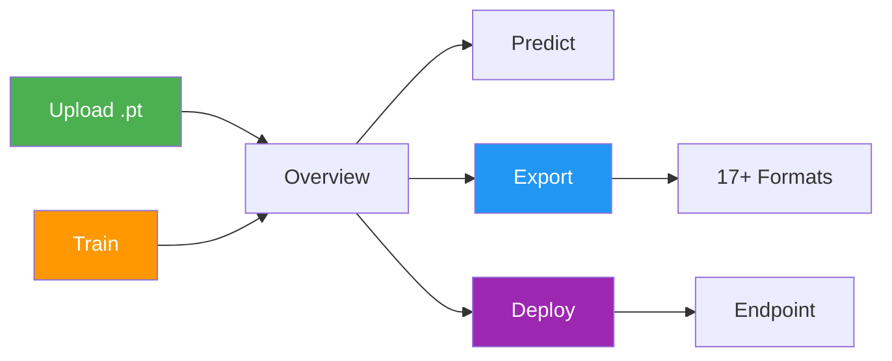
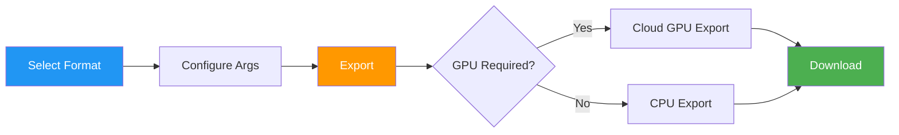

# Models

[Ultralytics Platform](https://platform.ultralytics.com) provides comprehensive model management for training, analyzing, and deploying YOLO models. Upload pretrained models or train new ones directly on the Platform.

<!-- Screenshot: platform-model-page-overview-tab.avif -->

## Upload Model

Upload existing model weights to the Platform:

1. Navigate to your project
2. **Drag and drop** `.pt` files onto the project page or models sidebar
3. Model metadata is parsed automatically from the file

Multiple files can be uploaded simultaneously (up to 3 concurrent).

<!-- Screenshot: platform-model-drag-drop-upload.avif -->

Supported model formats:

| Format  | Extension | Description               |
| ------- | --------- | ------------------------- |
| PyTorch | `.pt`     | Native Ultralytics format |

After upload, the Platform parses model metadata:

- Task type (detect, segment, pose, OBB, classify)
- Architecture (YOLO26n, YOLO26s, etc.)
- Class names and count
- Input size and parameters
- Training results and metrics (if present in checkpoint)

## Train Model

Train a new model directly on the Platform:

1. Navigate to your project
2. Click **New Model**
3. Select base model and dataset
4. Configure training parameters
5. Choose cloud or local training
6. Start training

See [Cloud Training](cloud-training.md) for detailed instructions.

## Model Lifecycle



## Model Page Tabs

Each model page has the following tabs:

| Tab          | Content                                       |
| ------------ | --------------------------------------------- |
| **Overview** | Model metadata, key metrics, dataset link     |
| **Train**    | Training charts, console output, system stats |
| **Predict**  | Interactive browser inference                 |
| **Export**   | Format conversion with GPU selection          |
| **Deploy**   | Endpoint creation and management              |

### Overview Tab

Displays model metadata and key metrics:

- Model name (editable), status badge, task type
- Final metrics (mAP50, mAP50-95, precision, recall)
- Metric sparkline charts showing training progression
- Training arguments (epochs, batch size, image size, etc.)
- Dataset link (when trained with a Platform dataset)
- Download button for model weights

<!-- Screenshot: platform-model-overview-metrics-and-args.avif -->

### Train Tab

The Train tab has three subtabs:

#### Charts Subtab

Interactive training metric charts showing loss curves and performance metrics over epochs:

| Chart Group       | Metrics                                        |
| ----------------- | ---------------------------------------------- |
| **Metrics**       | mAP50, mAP50-95, precision, recall             |
| **Train Loss**    | train/box_loss, train/cls_loss, train/dfl_loss |
| **Val Loss**      | val/box_loss, val/cls_loss, val/dfl_loss       |
| **Learning Rate** | lr/pg0, lr/pg1, lr/pg2                         |

<!-- Screenshot: platform-model-train-charts-subtab.avif -->

#### Console Subtab

Live console output from the training process:

- Real-time log streaming during training
- Epoch progress bars and validation results
- Error detection with highlighted error banners
- ANSI color support for formatted output

<!-- Screenshot: platform-model-train-console-subtab.avif -->

#### System Subtab

GPU and system metrics during training:

| Metric         | Description                |
| -------------- | -------------------------- |
| **GPU Util**   | GPU utilization percentage |
| **GPU Memory** | GPU memory usage           |
| **GPU Temp**   | GPU temperature            |
| **CPU Usage**  | CPU utilization            |
| **RAM**        | System memory usage        |
| **Disk**       | Disk usage                 |

<!-- Screenshot: platform-model-train-system-subtab.avif -->

### Predict Tab

Run interactive inference directly in the browser:

- Upload an image, paste a URL, or use webcam
- Results display with bounding boxes, masks, or keypoints
- Auto-inference when an image is provided
- Supports all task types (detect, segment, pose, OBB, classify)

!!! tip "Quick Testing"

    The Predict tab runs inference on Ultralytics Cloud, so you don't need a local GPU. Results are displayed with interactive overlays matching the model's task type.

### Export Tab

Export your model to 17+ deployment formats. See [Export Model](#export-model) below for full details.

### Deploy Tab

Create and manage dedicated inference endpoints. See [Deployments](../deploy/index.md) for details.

## Validation Plots

After training completes, view detailed validation analysis:

### Confusion Matrix

Interactive heatmap showing prediction accuracy per class:

<!-- Screenshot: platform-model-confusion-matrix.avif -->

### PR/F1 Curves

Performance curves at different confidence thresholds:

<!-- Screenshot: platform-model-pr-f1-curves.avif -->

| Curve                    | Description                              |
| ------------------------ | ---------------------------------------- |
| **Precision-Recall**     | Trade-off between precision and recall   |
| **F1-Confidence**        | F1 score at different confidence levels  |
| **Precision-Confidence** | Precision at different confidence levels |
| **Recall-Confidence**    | Recall at different confidence levels    |

## Export Model



Export your model to 17+ deployment formats:

1. Navigate to the **Export** tab
2. Select target format
3. Configure export arguments (image size, half precision, dynamic, etc.)
4. For GPU-required formats (TensorRT), select a GPU type
5. Click **Export**
6. Download when complete

<!-- Screenshot: platform-model-export-tab-format-list.avif -->

### Supported Formats

| #   | Format            | File Extension   | GPU Required | Use Case                           |
| --- | ----------------- | ---------------- | ------------ | ---------------------------------- |
| 1   | **ONNX**          | `.onnx`          | No           | Cross-platform, web, most runtimes |
| 2   | **TorchScript**   | `.torchscript`   | No           | PyTorch deployment without Python  |
| 3   | **OpenVINO**      | `.xml`, `.bin`   | No           | Intel CPUs, GPUs, VPUs             |
| 4   | **TensorRT**      | `.engine`        | Yes          | NVIDIA GPUs (fastest inference)    |
| 5   | **CoreML**        | `.mlpackage`     | No           | Apple iOS, macOS, watchOS          |
| 6   | **TF Lite**       | `.tflite`        | No           | Mobile (Android, iOS), edge        |
| 7   | **TF SavedModel** | `saved_model/`   | No           | TensorFlow Serving                 |
| 8   | **TF GraphDef**   | `.pb`            | No           | TensorFlow 1.x                     |
| 9   | **TF Edge TPU**   | `.tflite`        | No           | Google Coral devices               |
| 10  | **TF.js**         | `.json`, `.bin`  | No           | Browser inference                  |
| 11  | **PaddlePaddle**  | `.pdmodel`       | No           | Baidu PaddlePaddle                 |
| 12  | **NCNN**          | `.param`, `.bin` | No           | Mobile (Android/iOS), optimized    |
| 13  | **MNN**           | `.mnn`           | No           | Alibaba mobile runtime             |
| 14  | **RKNN**          | `.rknn`          | No           | Rockchip NPUs                      |
| 15  | **IMX500**        | `.imx`           | No           | Sony IMX500 sensor                 |
| 16  | **Axelera**       | `.axelera`       | No           | Axelera AI accelerators            |
| 17  | **ExecuTorch**    | `.pte`           | No           | PyTorch mobile runtime             |

### Format Selection Guide

**For NVIDIA GPUs:** Use **TensorRT** for maximum speed

**For Intel Hardware:** Use **OpenVINO** for Intel CPUs, GPUs, and VPUs

**For Apple Devices:** Use **CoreML** for iOS, macOS, Apple Silicon

**For Android:** Use **TF Lite** or **NCNN** for best performance

**For Web Browsers:** Use **TF.js** or **ONNX** (with ONNX Runtime Web)

**For Edge Devices:** Use **TF Edge TPU** for Coral, **RKNN** for Rockchip

**For General Compatibility:** Use **ONNX** — works with most inference runtimes

<!-- Screenshot: platform-model-export-progress.avif -->

!!! tip "Export Time"

    Export time varies by format. TensorRT exports may take several minutes due to engine optimization. GPU-required formats (TensorRT) run on Ultralytics Cloud GPUs.

## Clone Model

Clone a model to a different project:

1. Open the model page
2. Click the **Clone** button
3. Select the destination project
4. Click **Clone**

The model and its weights are copied to the target project.

## Download Model

Download your model weights:

1. Navigate to the model's **Overview** tab
2. Click the **Download** button
3. The original `.pt` file downloads automatically

Exported formats can be downloaded from the **Export** tab after export completes.

## Dataset Linking

Models can be linked to their source dataset:

- View which dataset was used for training
- Click the dataset card on the Overview tab to navigate to it
- Track data lineage

When training with Platform datasets using the `ul://` URI format, linking is automatic.

!!! example "Dataset URI Format"

    ```bash
    # Train with a Platform dataset — linking is automatic
    yolo train model=yolo26n.pt data=ul://username/datasets/my-dataset epochs=100
    ```

    The `ul://` scheme resolves to your Platform dataset. The trained model's Overview tab will show a link back to this dataset.

## Visibility Settings

Control who can see your model:

| Setting     | Description                     |
| ----------- | ------------------------------- |
| **Private** | Only you can access             |
| **Public**  | Anyone can view on Explore page |

To change visibility:

1. Open model actions menu
2. Click **Edit**
3. Toggle visibility
4. Click **Save**

## Delete Model

Remove a model you no longer need:

1. Open model actions menu
2. Click **Delete**
3. Confirm deletion

!!! note "Trash and Restore"

    Deleted models go to Trash for 30 days. Restore from Settings > Trash.

## FAQ

### What model architectures are supported?

Ultralytics Platform supports all YOLO architectures:

- **YOLO26**: n, s, m, l, x variants (recommended)
- **YOLO11**: n, s, m, l, x variants
- **YOLOv10**: Legacy support
- **YOLOv8**: Legacy support
- **YOLOv5**: Legacy support

All architectures support 5 task types: detect, segment, pose, OBB, classify.

### Can I download my trained model?

Yes, download your model weights from the model page:

1. Click the download icon on the Overview tab
2. The original `.pt` file downloads automatically
3. Exported formats can be downloaded from the Export tab

### How do I compare models across projects?

Currently, model comparison is within projects. To compare across projects:

1. Clone models to a single project, or
2. Export metrics and compare externally

### What's the maximum model size?

There's no strict limit, but very large models (>2GB) may have longer upload and processing times.

### Can I fine-tune pretrained models?

Yes! You can use any of the official YOLO26 models as a base, or select one of your own completed models from the model selector in the training dialog. The Platform supports fine-tuning from any uploaded checkpoint.
